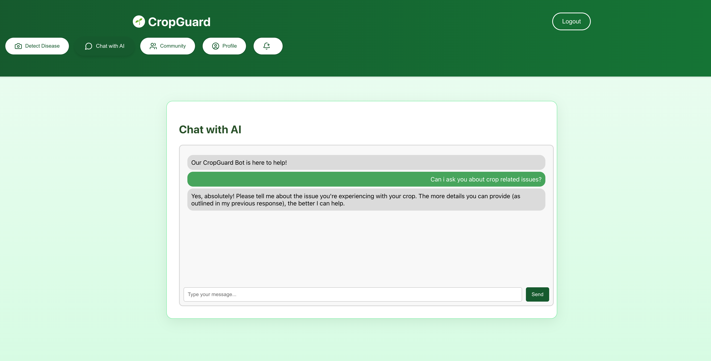
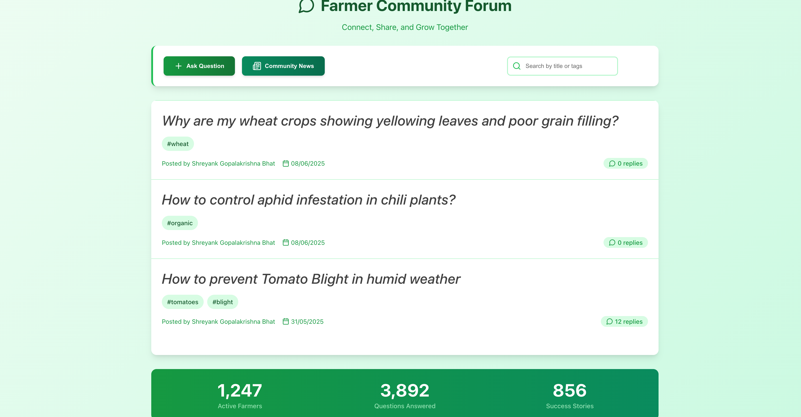
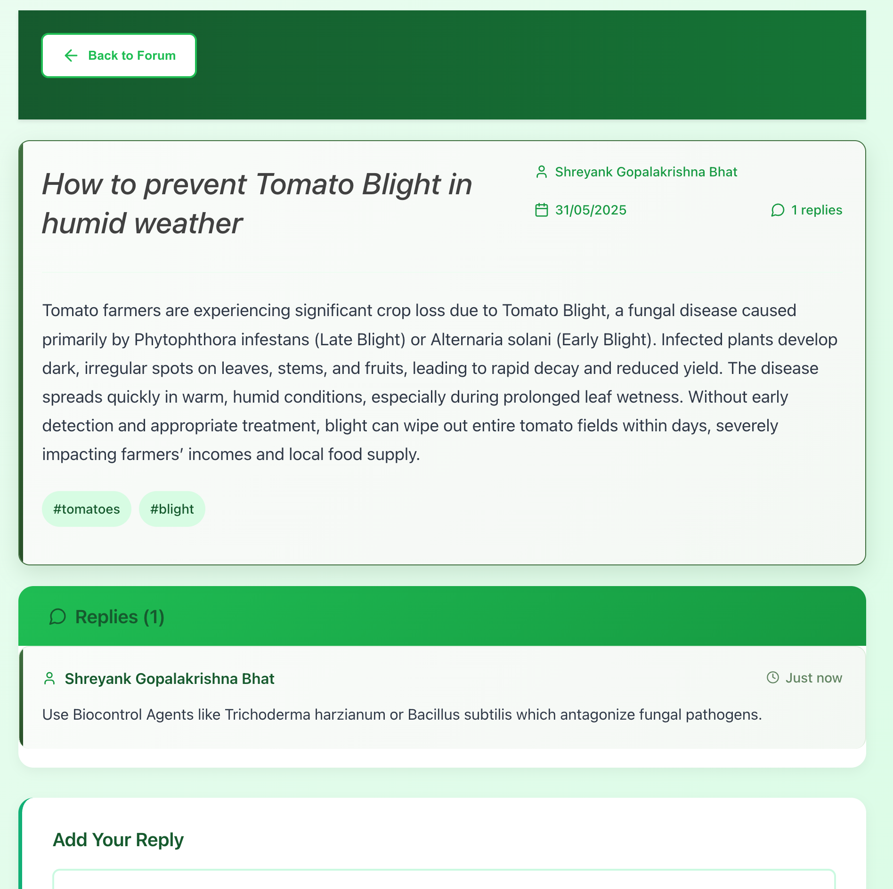
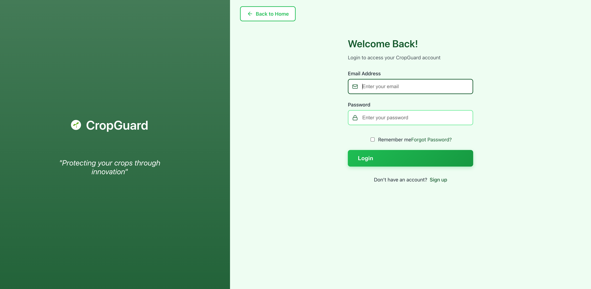
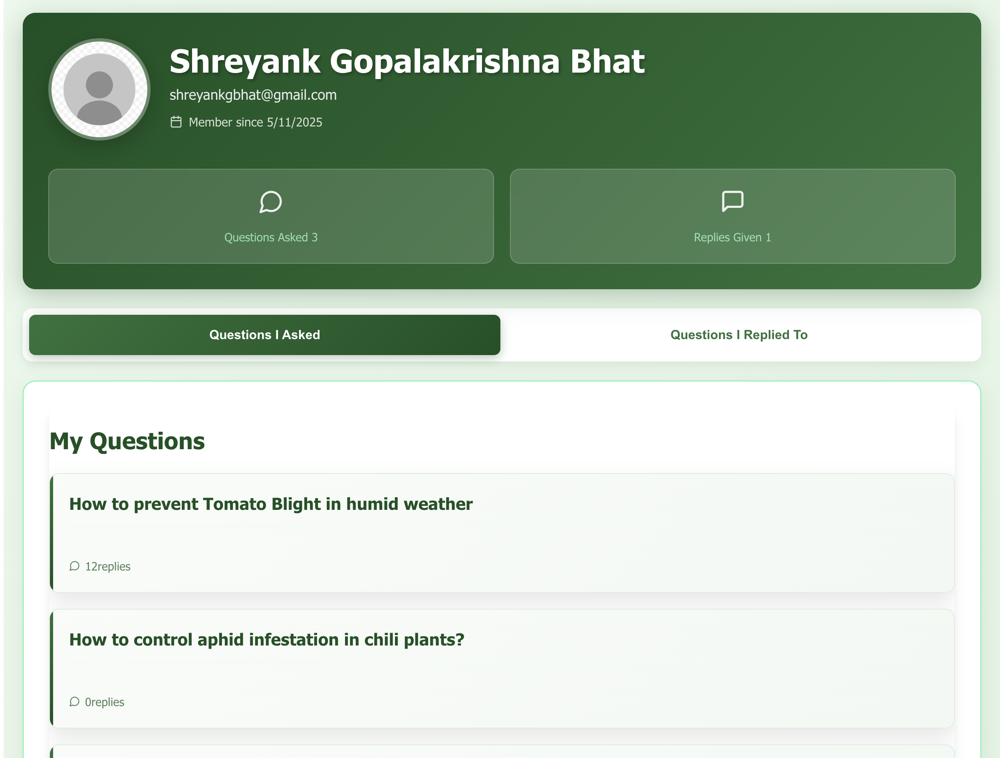
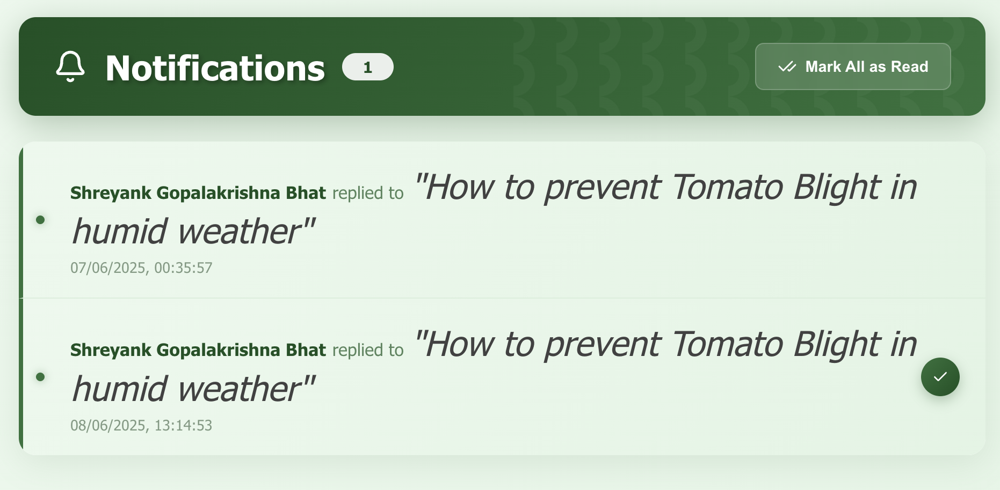

#  CropGaurd: Smart Crop Health & Farmer Support Platform

CropGaurd is an intelligent web application designed to assist farmers in diagnosing plant diseases, finding remedies, and connecting with a vibrant farming community. From disease prediction to interactive support, CropGaurd aims to empower farmers with technology and shared knowledge.

##  Features

###  Plant Disease Detection
- Upload images of your crop to detect potential diseases.
- Receive a diagnosis along with the **probability/odds** of the disease being present.

###  Chatbot Assistant
- Ask questions about crop health, fertilizers, pest control, or any other agricultural concerns.
- Get instant AI-generated responses and remedies.

###  Farmer Community Forum
- Share your farming experiences, best practices, and lessons.
- Ask questions and get responses from fellow farmers.
- Foster collaboration and mutual learning.

###  Smart Search
- Search through previous discussions and solutions.
- Use tag-based filtering to find answers to specific problems quickly.

###  Notification System
- Receive real-time updates and alerts for forum responses, replies, and community activity.

###  Secure User Authentication
- Signup and login functionality with encrypted password storage.
- Protects your data and activity.

###  User Profile Page
- View your previously asked questions and your contributions.
- Track your activity and stay engaged with the community.

---

## 📸 Screenshots

